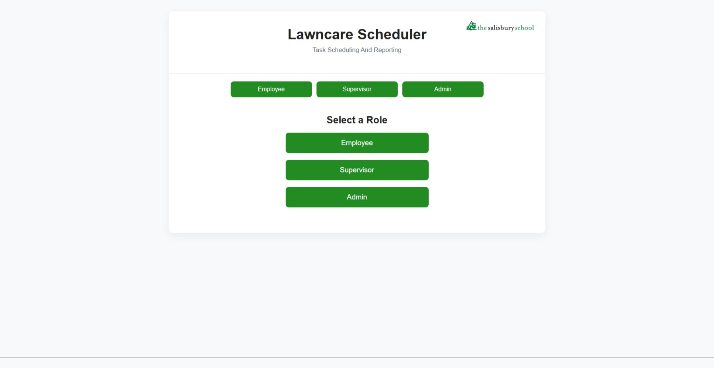
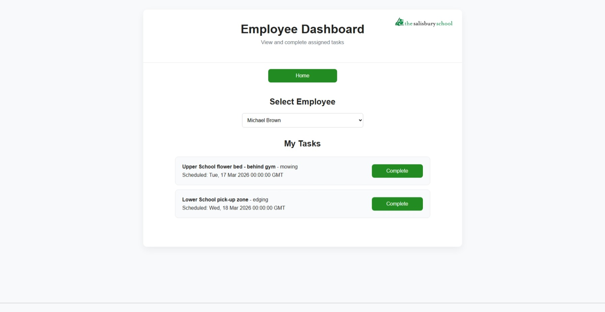
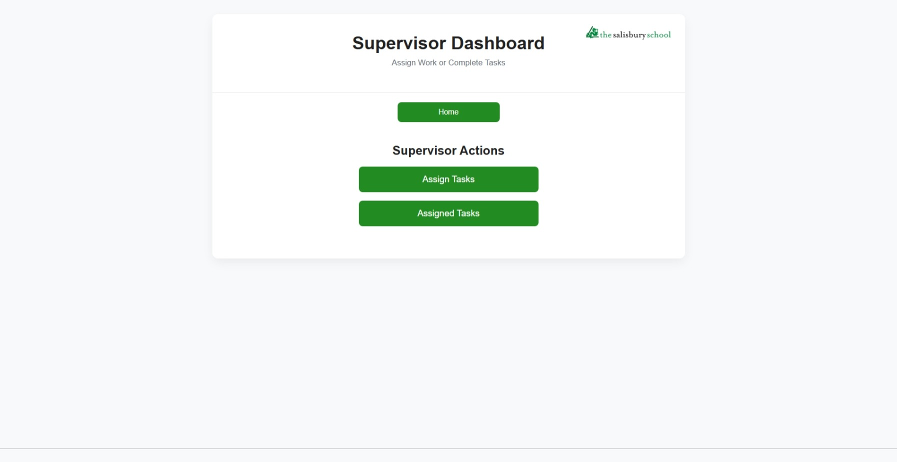
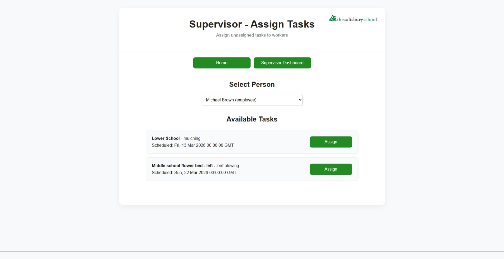
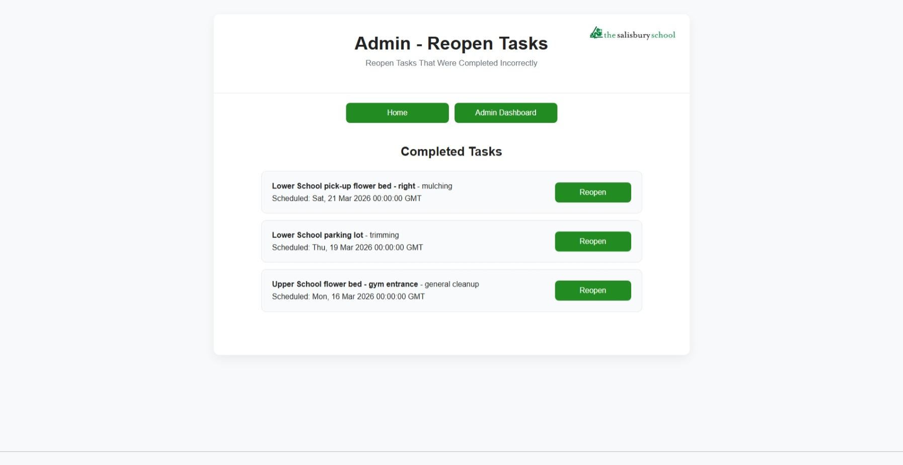
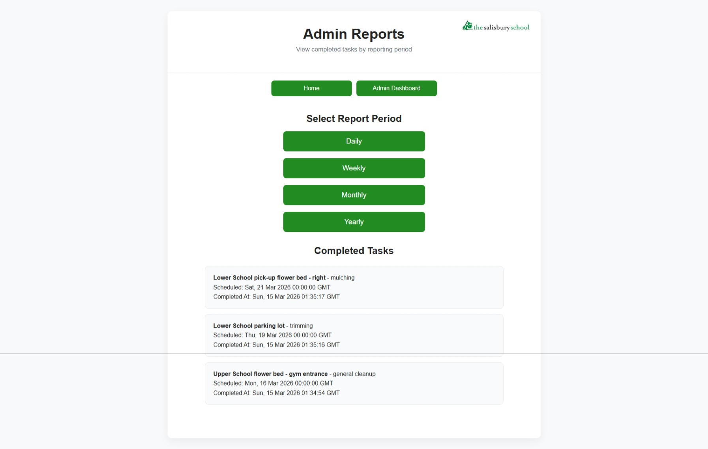

# Dragon Lawncare Tracker

A role-based task scheduling system for managing recurring lawncare and maintenance tasks.

This project demonstrates a full-stack web application built using Flask, PostgreSQL, and a lightweight frontend. It allows employees, supervisors, and administrators to manage recurring maintenance tasks through role-specific dashboards.

---

# Overview

The Lawncare Tracker is designed to manage routine outdoor maintenance tasks. The system allows different user roles to interact with tasks according to their responsibilities.

Key aspects of the project include:

- REST API development
- relational database design
- role-based application logic
- clean UI layout using shared templates

---

# Screenshots

### Homepage


### Employee Dashboard
Employees can view their assigned tasks and mark them as completed.



### Supervisor Dashboard
Supervisors can access tools to assign tasks and manage supervisor-level work.



### Supervisor Task Assignment
Supervisors can assign available tasks to employees or other supervisors.



### Reopen Completed Tasks (Admin)
Administrators can reopen tasks that were completed incorrectly.



### Completed Task Reporting
Administrators can view task completion reports for different time periods.



---

# Features

## Role-Based Dashboards

The application supports three user roles.

### Employee

Employees can:

- View tasks assigned to them
- Mark tasks as completed

### Supervisor

Supervisors can:

- Assign tasks to employees or supervisors
- View tasks assigned to supervisors
- Complete supervisor-level tasks

### Admin

Administrators can:

- Assign tasks
- Reopen completed tasks
- View completion reports

---

# Task Lifecycle

Tasks move through the following states:

unassigned → assigned → completed

If a task is reopened by an administrator, it returns to the **unassigned** state so it can be reviewed and reassigned.

---

# Reporting

The system includes built-in reporting endpoints for completed tasks.

Administrators can generate reports for:

- Daily completions
- Weekly completions
- Monthly completions
- Yearly completions

These reports help track maintenance activity and verify completed work.

---

# Tech Stack

## Backend

- Python
- Flask
- PostgreSQL
- psycopg

## Frontend

- HTML
- CSS
- JavaScript
- Jinja templating

## Configuration

- python-dotenv for environment variables

---

# Database Design

The database includes several primary tables:

- task
- areas
- tasktype
- people

A PostgreSQL view (`task_list`) is used to provide simplified task data to the application.

This view replaces internal foreign key IDs with readable values such as:

- area_name
- task_name
- assigned_to_name

This keeps API responses simple while preserving relational structure.

---

# Database Setup

The database setup is organized using numbered SQL scripts located in the `db/` directory.

These scripts are designed to be run in order:

- `001_schema.sql` — creates the database tables and relationships
- `002_seed.sql` — inserts initial sample data
- `003_views.sql` — creates database views used by the application

This structure allows the database to be recreated quickly and keeps schema changes organized.

---

# Project Structure

```
dragon-lawncare-tracker
│
├── app.py
├── requirements.txt
├── README.md
│
├── db
│   ├── 001_schema.sql
│   ├── 002_seed.sql
│   └── 003_views.sql
│
├── static
│   ├── style.css
│   └── images
│       └── top-logo.svg
│
├── templates
│   ├── base.html
│   ├── index.html
│   ├── employee.html
│   ├── supervisor.html
│   ├── supervisor_assign.html
│   ├── supervisor_tasks.html
│   ├── admin.html
│   ├── admin_assign.html
│   ├── admin_reopen.html
│   └── admin_reports.html
```

### Key Directories

**db/**  
Contains the SQL files used to create and initialize the database schema, seed data, and database views.

**templates/**  
HTML templates rendered by Flask using Jinja templating.

**static/**  
Static assets such as CSS and images used by the frontend.

---

# Running the Project

Clone the repository:

git clone https://github.com/Kyle-Krieg/dragon-lawncare-tracker  
cd dragon-lawncare-tracker

Create a virtual environment:

python -m venv venv

Activate the environment (Git Bash):

source venv/Scripts/activate

Install dependencies:

pip install -r requirements.txt

Create a `.env` file in the project root and add your database connection:

DATABASE_URL=your_postgres_connection_string

Run the application:

python app.py

Open your browser and navigate to:

http://localhost:5000

---

# Version Roadmap

## Version 1 (Current)

- Role-based dashboards
- Task assignment
- Task completion
- Task reopening
- Completion reporting
- Shared template layout
- Clean UI styling

## Version 2 (In Progress)

Planned improvements include:

- Replace seed data with real world data
- Recurring task regeneration
- User authentication
- Backend role authorization
- Gunicorn deployment
- Reverse proxy using Nginx

---

# Application Purpose

This application was created to streamline task management for recurring lawncare and maintenance work. Instead of relying on manual checklists and verbal communication, the system provides a centralized place to assign, track, and report completed tasks.

The goal is to reduce time spent managing routine work, prevent duplicate effort, and ensure that completed tasks are clearly documented and communicated across the team.